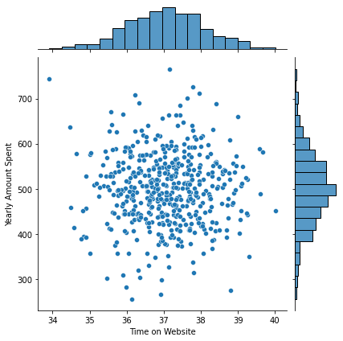
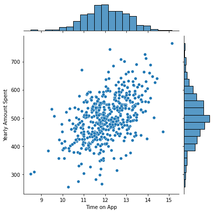
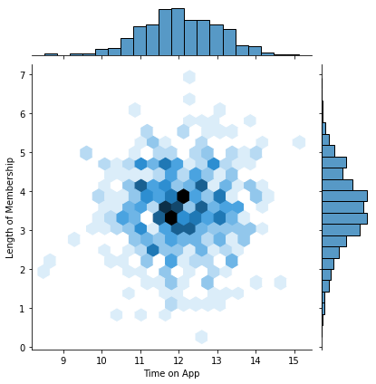
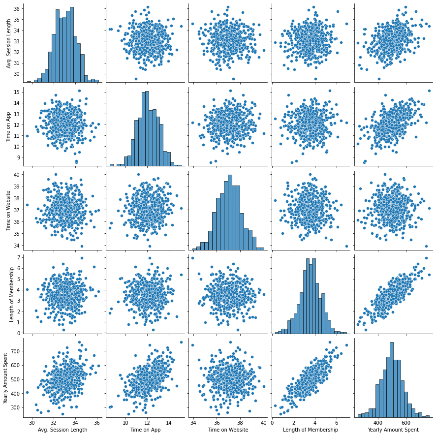
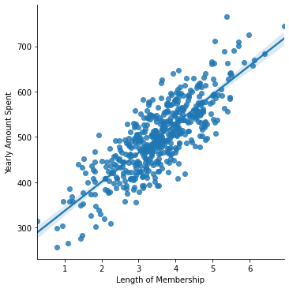
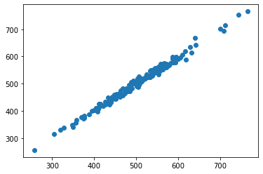
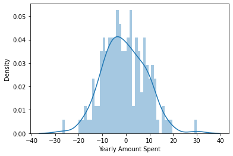

# Linear Regression Project

The ecommerce company based in New York City that sells clothing online is trying to decide whether to focus their efforts on their mobile app experience or their website. This is the project trying to give a solution.


```python
import pandas as pd
import numpy as np 
import matplotlib.pyplot as plt
import seaborn as sns
%matplotlib inline
```

## Get the Data

I'll work with the Ecommerce Customers csv file from the company. It has Customer info, such as Email, Address, and their color Avatar. Then it also has numerical value columns:

* Avg. Session Length: Average session of in-store style advice sessions.
* Time on App: Average time spent on App in minutes
* Time on Website: Average time spent on Website in minutes
* Length of Membership: Total number of years the customer has been a member. 


```python
customers = pd.read_csv('Ecommerce Customers')
```

**Check the head of customers, and check out its info() and describe() methods.**


```python
customers.head()
```


<div>
<style scoped>
    .dataframe tbody tr th:only-of-type {
        vertical-align: middle;
    }

    .dataframe tbody tr th {
        vertical-align: top;
    }

    .dataframe thead th {
        text-align: right;
    }
</style>
<table border="1" class="dataframe">
  <thead>
    <tr style="text-align: right;">
      <th></th>
      <th>Email</th>
      <th>Address</th>
      <th>Avatar</th>
      <th>Avg. Session Length</th>
      <th>Time on App</th>
      <th>Time on Website</th>
      <th>Length of Membership</th>
      <th>Yearly Amount Spent</th>
    </tr>
  </thead>
  <tbody>
    <tr>
      <th>0</th>
      <td>mstephenson@fernandez.com</td>
      <td>835 Frank Tunnel\nWrightmouth, MI 82180-9605</td>
      <td>Violet</td>
      <td>34.497268</td>
      <td>12.655651</td>
      <td>39.577668</td>
      <td>4.082621</td>
      <td>587.951054</td>
    </tr>
    <tr>
      <th>1</th>
      <td>hduke@hotmail.com</td>
      <td>4547 Archer Common\nDiazchester, CA 06566-8576</td>
      <td>DarkGreen</td>
      <td>31.926272</td>
      <td>11.109461</td>
      <td>37.268959</td>
      <td>2.664034</td>
      <td>392.204933</td>
    </tr>
    <tr>
      <th>2</th>
      <td>pallen@yahoo.com</td>
      <td>24645 Valerie Unions Suite 582\nCobbborough, D...</td>
      <td>Bisque</td>
      <td>33.000915</td>
      <td>11.330278</td>
      <td>37.110597</td>
      <td>4.104543</td>
      <td>487.547505</td>
    </tr>
    <tr>
      <th>3</th>
      <td>riverarebecca@gmail.com</td>
      <td>1414 David Throughway\nPort Jason, OH 22070-1220</td>
      <td>SaddleBrown</td>
      <td>34.305557</td>
      <td>13.717514</td>
      <td>36.721283</td>
      <td>3.120179</td>
      <td>581.852344</td>
    </tr>
    <tr>
      <th>4</th>
      <td>mstephens@davidson-herman.com</td>
      <td>14023 Rodriguez Passage\nPort Jacobville, PR 3...</td>
      <td>MediumAquaMarine</td>
      <td>33.330673</td>
      <td>12.795189</td>
      <td>37.536653</td>
      <td>4.446308</td>
      <td>599.406092</td>
    </tr>
  </tbody>
</table>
</div>


```python
customers.info()
```

    <class 'pandas.core.frame.DataFrame'>
    RangeIndex: 500 entries, 0 to 499
    Data columns (total 8 columns):
     #   Column                Non-Null Count  Dtype  
    ---  ------                --------------  -----  
     0   Email                 500 non-null    object 
     1   Address               500 non-null    object 
     2   Avatar                500 non-null    object 
     3   Avg. Session Length   500 non-null    float64
     4   Time on App           500 non-null    float64
     5   Time on Website       500 non-null    float64
     6   Length of Membership  500 non-null    float64
     7   Yearly Amount Spent   500 non-null    float64
    dtypes: float64(5), object(3)
    memory usage: 31.4+ KB


```python
customers.describe()
```


<div>
<style scoped>
    .dataframe tbody tr th:only-of-type {
        vertical-align: middle;
    }

    .dataframe tbody tr th {
        vertical-align: top;
    }

    .dataframe thead th {
        text-align: right;
    }
</style>
<table border="1" class="dataframe">
  <thead>
    <tr style="text-align: right;">
      <th></th>
      <th>Avg. Session Length</th>
      <th>Time on App</th>
      <th>Time on Website</th>
      <th>Length of Membership</th>
      <th>Yearly Amount Spent</th>
    </tr>
  </thead>
  <tbody>
    <tr>
      <th>count</th>
      <td>500.000000</td>
      <td>500.000000</td>
      <td>500.000000</td>
      <td>500.000000</td>
      <td>500.000000</td>
    </tr>
    <tr>
      <th>mean</th>
      <td>33.053194</td>
      <td>12.052488</td>
      <td>37.060445</td>
      <td>3.533462</td>
      <td>499.314038</td>
    </tr>
    <tr>
      <th>std</th>
      <td>0.992563</td>
      <td>0.994216</td>
      <td>1.010489</td>
      <td>0.999278</td>
      <td>79.314782</td>
    </tr>
    <tr>
      <th>min</th>
      <td>29.532429</td>
      <td>8.508152</td>
      <td>33.913847</td>
      <td>0.269901</td>
      <td>256.670582</td>
    </tr>
    <tr>
      <th>25%</th>
      <td>32.341822</td>
      <td>11.388153</td>
      <td>36.349257</td>
      <td>2.930450</td>
      <td>445.038277</td>
    </tr>
    <tr>
      <th>50%</th>
      <td>33.082008</td>
      <td>11.983231</td>
      <td>37.069367</td>
      <td>3.533975</td>
      <td>498.887875</td>
    </tr>
    <tr>
      <th>75%</th>
      <td>33.711985</td>
      <td>12.753850</td>
      <td>37.716432</td>
      <td>4.126502</td>
      <td>549.313828</td>
    </tr>
    <tr>
      <th>max</th>
      <td>36.139662</td>
      <td>15.126994</td>
      <td>40.005182</td>
      <td>6.922689</td>
      <td>765.518462</td>
    </tr>
  </tbody>
</table>
</div>


## Exploratory Data Analysis

**Use seaborn to create a jointplot to compare the Time on Website and Yearly Amount Spent columns to see the correlation.**


```python
sns.jointplot(x = 'Time on Website', y = 'Yearly Amount Spent', data = customers)
```


    <seaborn.axisgrid.JointGrid at 0x12b077b80>


    

    


** Do the same but with the Time on App column instead. **


```python
sns.jointplot(x = 'Time on App', y = 'Yearly Amount Spent', data = customers)
```


    <seaborn.axisgrid.JointGrid at 0x12ba05f10>


    

    


** Use jointplot to create a 2D hex bin plot comparing Time on App and Length of Membership.**


```python
sns.jointplot(x= 'Time on App', y= 'Length of Membership', kind="hex", data = customers)
```


    <seaborn.axisgrid.JointGrid at 0x12bb19910>


    

    


**Explore these types of relationships across the entire data set.** 


```python
sns.pairplot(data = customers)
```


    <seaborn.axisgrid.PairGrid at 0x12bb49ac0>


    

    


**Based off this plot, 'Length of Membership' looks to be the most correlated feature with Yearly Amount Spent.**


```python
X = customers[['Avg. Session Length', 'Time on App','Time on Website', 'Length of Membership']]
```


```python
y = customers['Yearly Amount Spent']
```

**Create a linear model plot (using seaborn's lmplot) of  Yearly Amount Spent vs. Length of Membership. **


```python
sns.lmplot(x='Length of Membership',y='Yearly Amount Spent',data=customers)
```


    <seaborn.axisgrid.FacetGrid at 0x12d436e80>


    

    


## Training and Testing Data

Split the data into training and testing sets.
** Set a variable X equal to the numerical features of the customers and a variable y equal to the "Yearly Amount Spent" column. **


```python
from sklearn.model_selection import train_test_split
```


```python
X_train, X_test, y_train, y_test = train_test_split(X, y, test_size=0.3, random_state=101)
```

** Use model_selection.train_test_split from sklearn to split the data into training and testing sets. Set test_size=0.3 and random_state=101**

## Training the Model

Now its time to train our model on our training data!

** Import LinearRegression from sklearn.linear_model **


```python
from sklearn.linear_model import LinearRegression
```

**Create an instance of a LinearRegression() model named lm.**


```python
lm = LinearRegression()
```

** Train/fit lm on the training data.**


```python
lm.fit(X_train,y_train)
```


    LinearRegression()


**Print out the coefficients of the model**


```python
print(lm.coef_)
```

    [25.98154972 38.59015875  0.19040528 61.27909654]


## Predicting Test Data
Now that we have fit our model, let's evaluate its performance by predicting off the test values!

** Use lm.predict() to predict off the X_test set of the data.**


```python
prediction = lm.predict(X_test)
```

** Create a scatterplot of the real test values versus the predicted values. **


```python
plt.scatter(y_test,prediction)
plt.xlabel = ('y_test')
plt.ylabel =('prediction')
```


    

    


## Evaluating the Model

Evaluate the model performance by calculating the residual sum of squares and the explained variance score (R^2).

** Calculate the Mean Absolute Error, Mean Squared Error, and the Root Mean Squared Error. 


```python
from sklearn import metrics
print('MAE:', metrics.mean_absolute_error(y_test, prediction))
print('MSE:', metrics.mean_squared_error(y_test, prediction))
print('RMSE:', np.sqrt(metrics.mean_squared_error(y_test, prediction)))
```

    MAE: 7.228148653430838
    MSE: 79.81305165097461
    RMSE: 8.933815066978642


## Residuals
 
**Plot a histogram of the residuals and make sure it looks normally distributed. 


```python
sns.distplot((y_test-prediction),bins=50);
```

    /Users/emma/opt/anaconda3/lib/python3.8/site-packages/seaborn/distributions.py:2551: FutureWarning: `distplot` is a deprecated function and will be removed in a future version. Please adapt your code to use either `displot` (a figure-level function with similar flexibility) or `histplot` (an axes-level function for histograms).
      warnings.warn(msg, FutureWarning)


    

    


## Conclusion
For the original question: Do we focus our efforst on mobile app or website development? 
I found out that App borught about more revenue and Membership Time is even more important.  

I'll interpret the coefficients to show the result.

** Recreate the dataframe below. **


```python
coeffecients = pd.DataFrame(lm.coef_,X.columns)
coeffecients.columns = ['Coeffecient']
coeffecients
```


<div>
<style scoped>
    .dataframe tbody tr th:only-of-type {
        vertical-align: middle;
    }

    .dataframe tbody tr th {
        vertical-align: top;
    }

    .dataframe thead th {
        text-align: right;
    }
</style>
<table border="1" class="dataframe">
  <thead>
    <tr style="text-align: right;">
      <th></th>
      <th>Coeffecient</th>
    </tr>
  </thead>
  <tbody>
    <tr>
      <th>Avg. Session Length</th>
      <td>25.981550</td>
    </tr>
    <tr>
      <th>Time on App</th>
      <td>38.590159</td>
    </tr>
    <tr>
      <th>Time on Website</th>
      <td>0.190405</td>
    </tr>
    <tr>
      <th>Length of Membership</th>
      <td>61.279097</td>
    </tr>
  </tbody>
</table>
</div>


- Holding all other features fixed, a 1 unit increase in **Avg. Session Length** is associated with an **increase of 25.98 total dollars spent**.
- Holding all other features fixed, a 1 unit increase in **Time on App** is associated with an **increase of 38.59 total dollars spent**.
- Holding all other features fixed, a 1 unit increase in **Time on Website** is associated with an **increase of 0.19 total dollars spent**.
- Holding all other features fixed, a 1 unit increase in **Length of Membership** is associated with an **increase of 61.27 total dollars spent**.

## Suggestions and future steps:

- Mobile users have a higer tendency to complete an order and have a higher yearly amount spent, so for the company to achieve higher revenue they can find ways to improve the website.
- Find ways to improve the mobile application to keep users since its already working well.
- The reason why people using the mobile app show more certain positive correlation for yearly amount spent can also be because they are already committed customers since they actually go through the process downloading the app. It is worth looking further into with more data.
